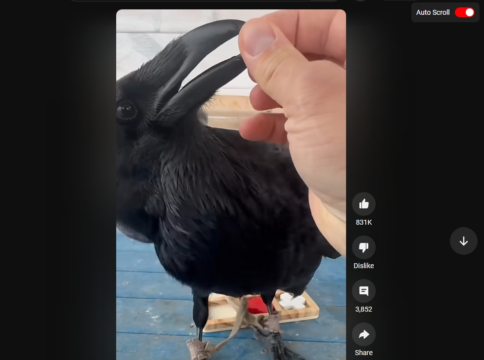

# YouTube Shorts Auto Scroll

A Chrome extension that automatically scrolls through YouTube Shorts videos when they finish playing.

## Features

- Auto-scroll through Shorts videos
- Toggle auto-scroll on/off with a convenient menu
- Persists your auto-scroll preference
- Clean and minimal UI
- Lightweight performance impact

## Installation

1. Download or clone this repository
2. Open Chrome/Edge and go to `chrome://extensions/` or `edge://extensions/`
3. Enable "Developer mode" in the top right
4. Click "Load unpacked" and select the extension directory

## Usage

1. Go to YouTube Shorts
2. Look for the "Auto Scroll" toggle in the top right
3. Enable auto-scroll to automatically advance to the next video when the current one ends
4. Disable any time to return to manual scrolling

## Technical Details

The extension uses:
- Chrome Extension Manifest V3
- Content Scripts for YouTube integration
- Chrome Storage API for persistence
- MutationObserver for page changes
- Video events for playback detection

## Files

- `manifest.json` - Extension configuration
- `content.js` - Core functionality
- `styles.css` - UI styling

## License

MIT License

## Contributing

Pull requests are welcome! Feel free to open issues for any bugs or feature requests.